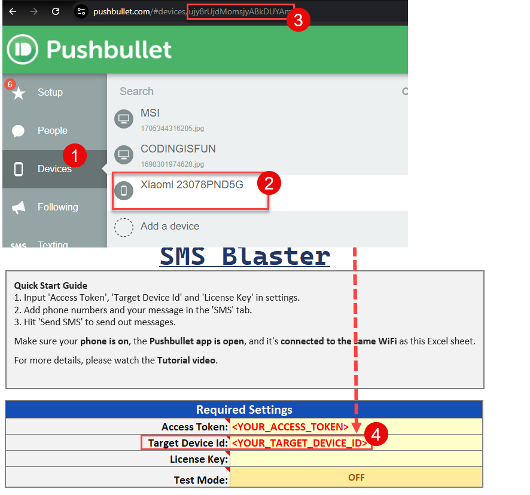

# How to send SMS from two or more cell phones

To send SMS from multiple cell phones using the SMS Blaster, follow these steps:

1. **Install Pushbullet on Each Phone:**
   * For each phone you’re using, install the Pushbullet app and log in with the same Pushbullet account.
2. **Set Up in Pushbullet:**
   * Once set up, each phone should appear in your online Pushbullet account. From there, you can find the device ID for each phone.
3. **Insert Device IDs in SMS Blaster:**
   * Copy the device ID from your Pushbullet account and insert it into the SMS Blaster tool for each phone.

<figure><figcaption></figcaption></figure>

**Optional: Create a Dropdown Menu:**

To easily switch between different devices, you can create a dropdown menu in the "Target Device ID" field. This allows you to select which phone to use when sending messages. For a tutorial on how to insert a dropdown menu, watch this video: [Insert Dropdown Menu](https://youtu.be/udv5tffwEX0?si=VZPT1dvN12tVyhCR).
