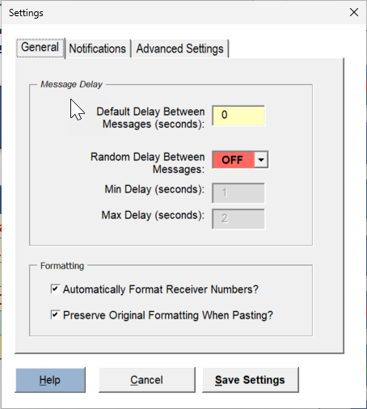

# My SMS is marked as sent on my phone but the recipient does not receive it

If the SMS is marked as sent on your phone but the recipient does not receive it, this is often due to your mobile service provider blocking the messages. This issue can occur, particularly if you are using a prepaid line.

In such cases:

1. **Contact your mobile phone provider** to check if your number has been flagged, blocked, or limited. Ask if they can increase your sending limit or provide details on any restrictions.
2.  **Adjust the Random Delay Setting:**

    * The SMS Blaster includes a default random delay to make bulk messages less conspicuous. You can increase this delay in the settings if necessary. However, note that longer delays will result in extended runtimes for bulk campaigns and may not guarantee delivery.

    **Delay Settings Example:**\
    
